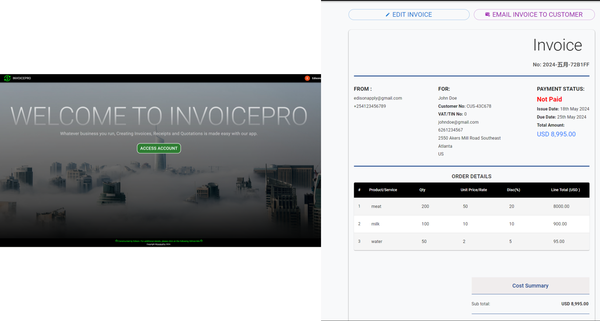
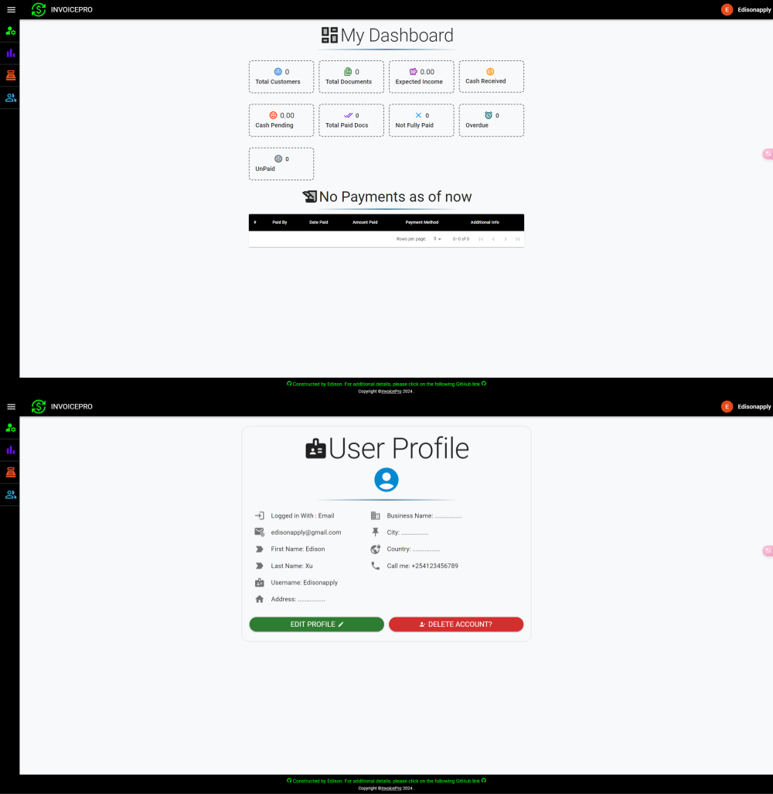
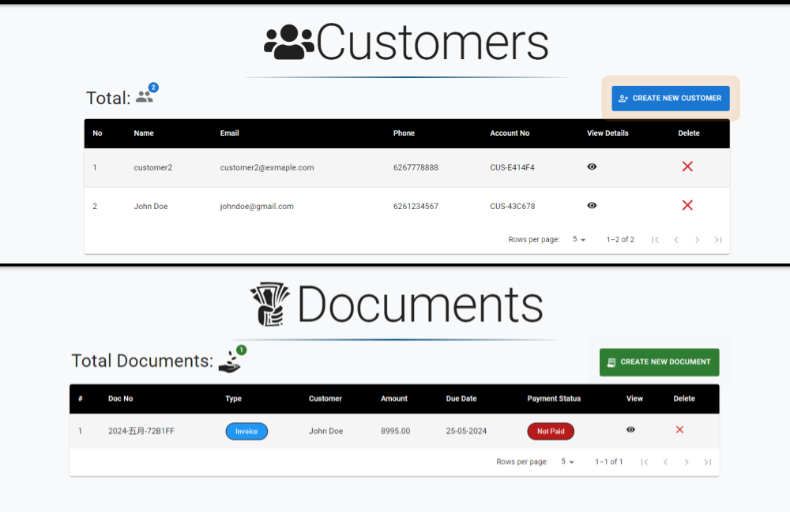
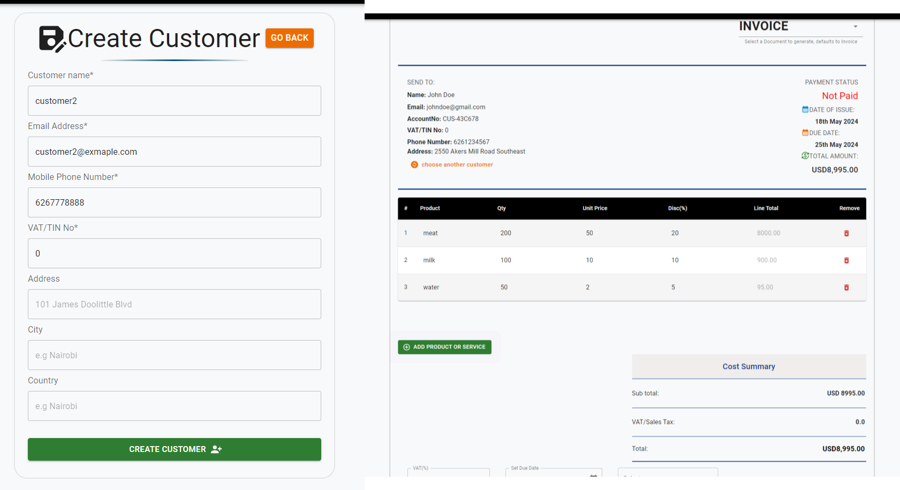

# MERN Invoice Project

The MERN Invoice Management System is a comprehensive application designed to manage invoices, customers, and payments. It leverages the MERN stack (MongoDB, Express, React, Node.js) and includes features such as invoice management(creating, editing, viewing, and managing invoices), user authentication, user  management, invoice PDF generation, email notifications, and role-based access control. The project is modular, ensuring that both the frontend and backend are well-organized and maintainable.

## Table of Contents
- [Features](#features)
- [File Structure](#file-structure)
- [Demo View](#demo-view)
- [Installation](#installation)
- [Usage](#usage)
- [API Endpoints](#api-endpoints)
- [Contact](#contact)
- [License](#license)

## Features

- **Invoice Management:** Create, edit, view, and delete invoices.
- **Customer Management:** Manage customer information.
- **Payment Handling:** Record and manage payments for invoices.
- **PDF Generation:** Generate PDF versions of invoices for emailing or printing.
- **User Interface:** User-friendly interface built with React and Material-UI.
- **Responsive Design:** Works on both desktop and mobile devices.

# Demo View







## File Structure

### Backend

| File Name               | Description                                                                 |
|-------------------------|-----------------------------------------------------------------------------|
| `userRoutes.js`         | Defines routes for user management, including retrieving and updating user info. |
| `roleMiddleware.js`     | Contains role constants and middleware for role-based access control.        |
| `checkAuthMiddleware.js`| Middleware for checking user authentication.                                 |
| `errorMiddleware.js`    | Handles errors and undefined routes.                                         |
| `apiLimiter.js`         | Middleware functions for API rate limiting.                                  |
| `index.js`              | Defines user role constants.                                                 |
| `sendEmail.js`          | Module for sending emails.                                                   |
| `Logger.js`             | Logger for system logs.                                                      |
| `pdfTemplate.js`        | Module for generating invoice PDF templates.                                 |
| `emailTemplate.js`      | Module for generating email templates.                                       |
| `options.js`            | Configuration options for generating PDF files.                              |
| `getAllUserCustomers.js`| Controller for fetching all customer info.                                    |
| `getSingleUserCustomer.js`| Controller for fetching single customer info.                             |
| `createCustomer.js`     | Controller for creating customer info.                                       |
| `updateCustomerInfo.js` | Controller for updating customer info.                                       |
| `deleteCustomer.js`     | Controller for deleting customer info.                                       |
| `createPayment.js`      | Controller for creating payment records.                                     |
| `generatePDF.js`        | Controller for generating PDF documents and sending emails.                  |
| `deleteDocument.js`     | Controller for deleting documents.                                           |
| `getSingleUserDocument.js`| Controller for fetching single user document.                             |
| `userModel.js`          | Defines the user model and schema.                                           |
| `verifyResetTokenModel.js`| Defines the reset password token model.                                    |
| `customerModel.js`      | Defines the customer info model.                                             |
| `documentModel.js`      | Defines the document model and payment record structure.                     |
| `emailTransport.js`     | Helper module for configuring email transport.                               |
| `multer.js`             | Helper functions for file uploads.                                           |

### Frontend

| File Name               | Description                                                                 |
|-------------------------|-----------------------------------------------------------------------------|
| `main.76aa106a.js`      | Main JavaScript code for the project.                                       |
| `787.c4e7f8f9.chunk.js` | Performance monitoring code.                                                |
| `index.js`              | Entry file for the React application.                                       |
| `customTheme.js`        | Defines custom Material-UI theme.                                           |
| `reportWebVitals.js`    | Monitors web performance metrics.                                           |
| `roles.js`              | Defines user role constants for authentication and authorization.           |
| `customersApiSlice.js`  | Handles API requests related to customers.                                  |
| `authApiSlice.js`       | Handles API operations for authentication.                                  |
| `authSlice.js`          | Creates Redux slice for authentication, including login and logout actions. |
| `baseApiSlice.js`       | Creates base API slice with support for authentication and token refresh.    |
| `usersApiSlice.js`      | Handles API requests related to user data.                                  |
| `documentsApiSlice.js`  | Handles API requests related to documents.                                  |
| `styling.js`            | Helper functions for setting document status and type styles.               |
| `authButtonAnimations.js`| Component file for authentication button animations.                       |
| `store.js`              | Configures Redux Store with reducers and middleware.                        |
| `password-strength.js`  | Utility functions for password strength evaluation and indicators.          |
| `main.425bd0e3.css`     | Custom styles for the Toastify library and other elements.                  |
| `index.css`             | Defines the appearance and layout of webpage elements.                      |
| `customer-button.css`   | Styles for customer buttons.                                                |
| `homepage.css`          | Styles for homepage background and header.                                  |
| `spinner.css`           | CSS styles for loading spinner animation.                                   |
| `App.jsx`               | Main component of the React application, includes pages, components, and layout using Material-UI and React Router. |

### Components and Pages

| File Name               | Description                                                                 |
|-------------------------|-----------------------------------------------------------------------------|
| `CustomersPage.jsx`     | Displays customer list with basic info and action buttons.                  |
| `CustomerEditForm.jsx`  | Form for editing customer info (name, email, address, etc.).                |
| `SingleCustomerPage.jsx`| Displays detailed info for a single customer with edit and delete options.  |
| `CustomerSVG.jsx`       | Page for displaying customer SVG image and tooltip info.                    |
| `CustomerCreateForm.jsx`| Form for creating a new customer (name, email, address, etc.).              |
| `VerifiedPage.jsx`      | Displays success message after user account verification.                   |
| `LoginPage.jsx`         | User login page with login form and links.                                  |
| `ResendEmailTokenPage.jsx`| Page for resending verification email with email input form and button.  |
| `PasswordResetRequestPage.jsx`| Page for requesting password reset with email input form and submit button. |
| `RegisterPage.jsx`      | User registration page with form, login link, and Google login option.      |
| `PasswordResetPage.jsx` | Page for resetting user password with new password input form and strength indicator. |
| `LoginForm.jsx`         | Implementation of user login form (email, password input, login button).    |
| `AuthWrapper.jsx`       | Wraps other authentication-related components to ensure they are centered on the page. |
| `RegisterForm.jsx`      | Implementation of user registration form (name, username, email, password inputs). |
| `EditProfileForm.jsx`   | Form for editing user profile (name, username, phone number, etc.).         |
| `UsersListPage.jsx`     | Page displaying user list with action buttons.                              |

* File Structure is generated by AI


## Installation

To install and run this project locally, follow these steps:

1. **Clone the repository:**
    ```bash
    git clone https://github.com/yourusername/mern-invoice-project.git
    cd mern-invoice-project
    ```

2. **Install dependencies for both server and client:**
    ```bash
    # Install server dependencies
    cd backend
    npm install
    
    # Install client dependencies
    cd ../client
    npm install
    ```

3. **Set up environment variables:**
    Create a `.env` file in the `backend` directory with the following contents:
    ```env
    NODE_ENV=development
    PORT=5000
    MONGO_URI=your_mongodb_connection_string
    JWT_SECRET=your_jwt_secret
    MAILGUN_API_KEY=your_mailgun_api_key
    MAILGUN_DOMAIN=your_mailgun_domain
    ```

4. **Run the application:**
    ```bash
    # Run server
    cd backend
    npm run dev
    
    # Run client
    cd ../client
    npm start
    ```

## Usage

Once the application is running, you can access it at `http://localhost:3000`.

* Also, you need to set up with the .env file


### Key Pages and Components

- **Documents Page (`DocumentsPage.jsx`):** Displays a list of invoices with options to view, delete, and create new invoices.
- **Single Document Page (`SingleDocumentPage.jsx`):** Shows detailed information about a specific invoice, including payment records and customer details.
- **Document Create/Edit Form (`DocCreateEditForm.jsx`):** Form for creating or editing an invoice, including adding items, selecting customers, and specifying terms.
- **Payment Form (`PaymentForm.jsx`):** Form for recording payments, including selecting payment method and entering payment details.
- **Payment Date Component (`PaymentDate.jsx`):** Component for selecting payment date using a date picker.

## API Endpoints

The backend provides several API endpoints for managing invoices and customers. Here are some key endpoints:

- **Customers:**
  - `GET /api/customers`: Get a list of all customers.
  - `POST /api/customers`: Create a new customer.
  - `GET /api/customers/:id`: Get a specific customer by ID.
  - `PUT /api/customers/:id`: Update a specific customer by ID.
  - `DELETE /api/customers/:id`: Delete a specific customer by ID.

- **Invoices:**
  - `GET /api/invoices`: Get a list of all invoices.
  - `POST /api/invoices`: Create a new invoice.
  - `GET /api/invoices/:id`: Get a specific invoice by ID.
  - `PUT /api/invoices/:id`: Update a specific invoice by ID.
  - `DELETE /api/invoices/:id`: Delete a specific invoice by ID.

- **Payments:**
  - `POST /api/payments`: Record a new payment.
 ..............................change its content


**Contact:**
  - For any queries, feedback, or collaboration opportunities, feel free to connect:

 - Author: Shweta
 - GitHub: (https://github.com/Shweta-Singh30)
  - Email: shwetasingh43763@gmail.com